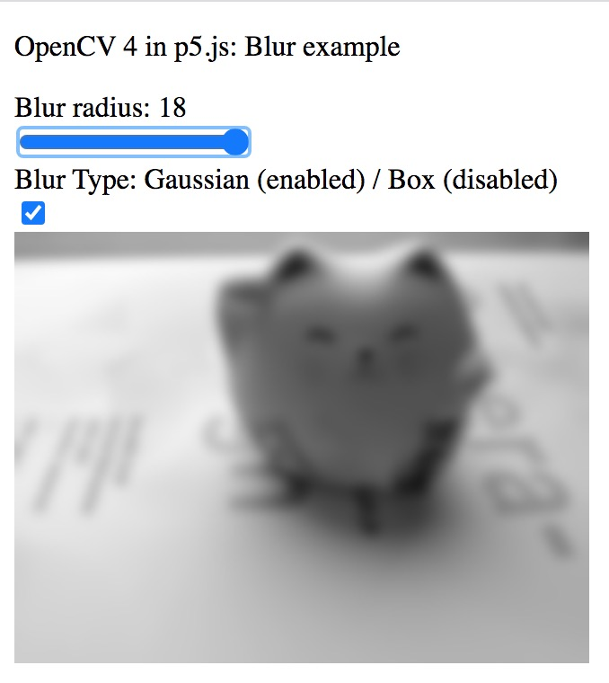
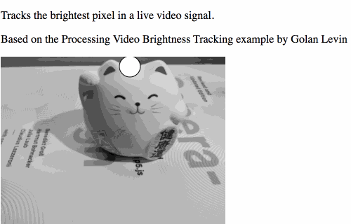
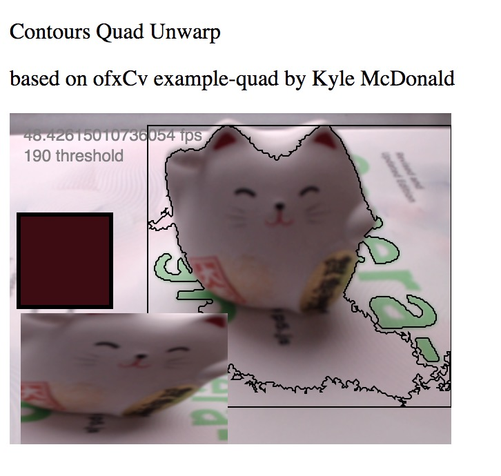

# p5.js-cv
p5.js port of Kyle McDonald's ofxCv library using OpenCV.js

### Examples

- Threshold:
- Blur:
- Brightness Tracking:
- Background Subtraction:
- Contour Quads:
- Optical Flow:

For more see the examples folder

### Installation

The `lib` folder contains the minified [`p5.cv.min.js`](lib/p5.cv.min.js) which can be included alongside `p5.min.js` in your project.

**Note** You will also need `opencv.js`. You can find version 4.4.0 in [lib/opencv.js](lib/opencv.js). You can find other versions on the official [OpenCV.org](https://opencv.org/) website.

### Minimal Threshold example:

```javascript

// input p5.Image
let sourceImage;
// desination Mat
let destinationMat;

function preload(){
  sourceImage = loadImage('yourImage.png');
}

function setup() {
  createCanvas(1280, 960);
  
  // convert p5.Image to OpenCV Mat
  destinationMat = p5.cv.imageToNewMat(sourceImage);
  // convert from RGBA (p5 / Canvas) to Grayscale
  p5.cv.convertColor(destinationMat, destinationMat, cv.COLOR_RGBA2GRAY);
  // auto-threshold
  p5.cv.autothreshold(myMatGrayscale);
  
  // preview
  // display source
  image(sourceImage, 0, 0);
  // display thresholded destination Mat
  p5.cv.drawMat(myMatGrayscale, sourceImage.width, 0);
}
```

### What this project is 

The project aims to simplify getting into Computer Vision by acting a bridge between p5.js and OpenCV.js

It attempts to be a port of [Kyle McDonald's ofxCv](https://github.com/kylemcdonald/ofxCv)

Currently it's still WIP with a few examples and functions yet to be ported,
however the majority of useful wrapper functions are present, greatly facilitating common Computer Vision tasks. 

### What this project isn't

This project aims to be a learning / practicing tool and not a high performance library ready for large projects.

It uses the prebuild version of OpenCV.js 4.4.0 without any extra addons or optimisations.

As previously mentioned, this ofxCv port is not 100% complete (yet)

Here is an overview of functionality yet to be ported: more info [here](https://github.com/orgicus/p5.js-cv/wiki/Contribution)

### Aknowledgements

I'd like to thank [Golan Levin](http://flong.com/) for the wise advice, mentorship and wealth of knowledge user experience.

Additionally this project is very much based on the contributions of [Kyle McDonald](http://kylemcdonald.net/) and [Greg Borenstein](https://github.com/atduskgreg/opencv-processing).


